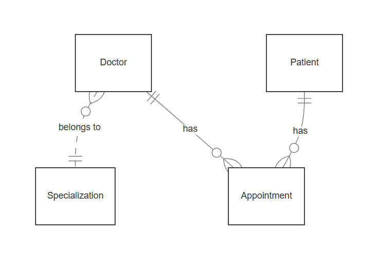

# Health Portal Project

## Overview
The Health Portal Project is a web application designed to manage healthcare appointments, doctors, and patients. It uses a modern tech stack, including React for the frontend, Spring Boot for the backend, and PostgreSQL for the database. The application is containerized using Docker for easy deployment and management.

---

## Setup and Installation Instructions

### Prerequisites
Ensure you have the following installed on your machine:
- [Node.js](https://nodejs.org/) (v18 or above)
- [Docker](https://www.docker.com/)
- [Docker Compose](https://docs.docker.com/compose/)
- [PostgreSQL](https://www.postgresql.org/) (if running locally outside Docker)

### Directory Structure
- `frontend/`: React frontend application.
- `backend/`: Spring Boot backend application.
- `nginx.conf`: Custom Nginx configuration for serving the frontend.
- `docker-compose.yml`: Docker Compose configuration file.
- `database/`: Contains seed data for the PostgreSQL database.

---

## Running the Application Locally in Docker Containers

### Step 1: Build and Run Docker Containers
1. Navigate to the project root.
2. Run the following commands:

```bash
docker-compose up --build
```

This command will:
- Build the React frontend, Spring Boot backend, and PostgreSQL database containers.
- Start all services and expose them as defined in the `docker-compose.yml` file.

### Step 2: Access the Application
Once the containers are running:
- **Frontend**: [http://localhost:3000](http://localhost:80)
- **Backend API**: [http://localhost:8080](http://localhost:8080)
- **PostgreSQL**: Accessible on `localhost:5432` (if needed).

---

## Database Schema and Seed Data

### Database Schema
- **Patients**:
    - `id`: Primary Key
    - `email`: Unique
    - `first_name`
    - `last_name`
    - `date_of_birth`

- **Doctors**:
    - `id`: Primary Key
    - `first_name`
    - `last_name`
    - `specialization_id`: Foreign Key referencing `Specialization`

- **Specializations**:
    - `id`: Primary Key
    - `name`: Unique

- **Appointments**:
    - `id`: Primary Key
    - `patient_id`: Foreign Key referencing `Patients`
    - `doctor_id`: Foreign Key referencing `Doctors`
    - `appointment_date_time`
    - `visit_type`
    - `confirmed`

### Seed Data
Add initial data to the `database/seed.sql` file:

```sql
INSERT INTO specializations (id, name) VALUES
(1, 'Cardiology'),
(2, 'Pediatrics'),
(3, 'Dermatology'),
(4, 'Orthopedics'),
(5, 'Neurology');

INSERT INTO doctors (first_name, last_name, specialization_id) VALUES
('John', 'Doe', 1),
('Jane', 'Smith', 2);

INSERT INTO patients (email, first_name, last_name, date_of_birth) VALUES
('patient1@example.com', 'Alice', 'Johnson', '1985-05-15');

INSERT INTO appointments (patient_id, doctor_id, appointment_date_time, visit_type) VALUES
(1, 1, '2024-12-15T10:00:00', 'IN_PERSON');
```

---

## Commands for Building and Running the Docker Containers

### Build the Containers
```bash
docker-compose build
```

### Start the Containers
```bash
docker-compose up
```

### Stop the Containers
```bash
docker-compose down
```

### Rebuild Specific Service
For example, rebuild only the frontend:
```bash
docker-compose up --build frontend
```

---

### Test the application
Go to http://localhost:3000 in the browser

